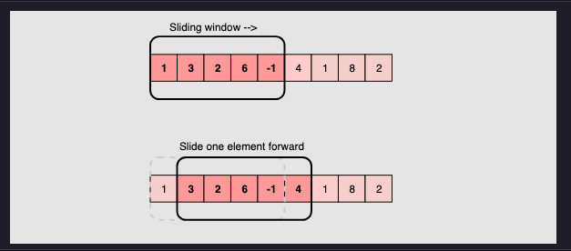
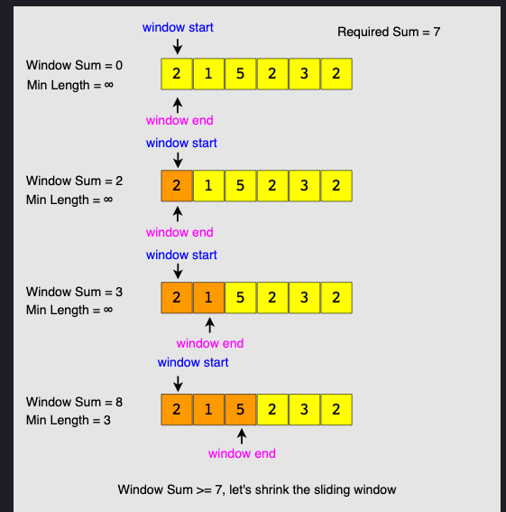
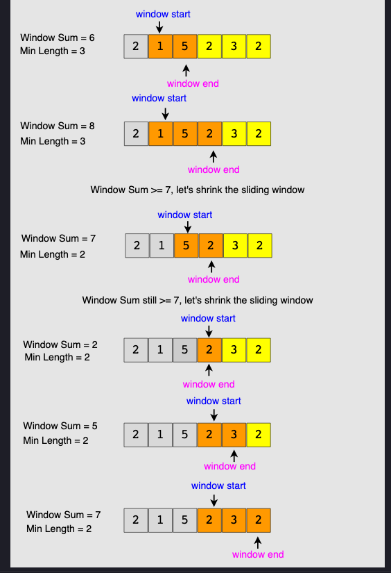
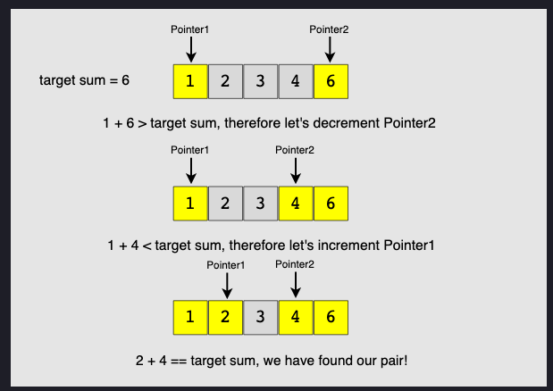

# cracking_the_code
Repository regarding coding interview questions and challenges

# Topics

## Sliding Window
In many problems dealing with an array (or a LinkedList), 
we are asked to find or calculate something among all the subarrays (or sublists) of a given size. 
For example, take a look at this problem
```
Given an array, find the average of all subarrays of ‘K’ contiguous elements in it.
```

Let’s understand this problem with a real input:
``` python
Array: [1, 3, 2, 6, -1, 4, 1, 8, 2], K=5
```
Here, we are asked to find the average of all subarrays of ‘5’ contiguous elements in the given array.
Let’s solve this:

1. For the first 5 numbers (subarray from index 0-4), the average is: (1+3+2+6-1)/5 => 2.2
(1+3+2+6−1)/5=>2.2
2. The average of next 5 numbers (subarray from index 1-5) is: (3+2+6-1+4)/5 => 2.8
(3+2+6−1+4)/5=>2.8
3. For the next 5 numbers (subarray from index 2-6), the average is: (2+6-1+4+1)/5 => 2.4
(2+6−1+4+1)/5=>2.4
4. ...

Here is the final output containing the averages of all subarrays of size 5:
``` python
Output: [2.2, 2.8, 2.4, 3.6, 2.8]
```

A brute-force algorithm will calculate the sum of every 5-element subarray of the given array and 
divide the sum by ‘5’ to find the average. This is what the algorithm will look like:

``` python
def find_averages_of_subarrays(K, arr):
  result = []
  for i in range(len(arr)-K+1):
    # find sum of next 'K' elements
    _sum = 0.0
    for j in range(i, i+K):
      _sum += arr[j]
    result.append(_sum/K)  # calculate average

  return result


def main():
  result = find_averages_of_subarrays(5, [1, 3, 2, 6, -1, 4, 1, 8, 2])
  print("Averages of subarrays of size K: " + str(result))


main()
```

**Time complexity**: Since for every element of the input array, we are calculating the sum 
of its next ‘K’ elements, the time complexity of the above algorithm will be O(N*K)
where ‘N’ is the number of elements in the input array.

Can we find a better solution? Do you see any inefficiency in the above approach?

The inefficiency is that for any two consecutive subarrays of size ‘5’, the overlapping part (which will contain four elements) will be evaluated twice. For example, take the above-mentioned input:


As you can see, there are four overlapping elements between the subarray 
(indexed from 0-4) and the subarray (indexed from 1-5). 
Can we somehow reuse the sum we have calculated for the overlapping elements?

The efficient way to solve this problem would be to visualize each subarray as a
sliding window of ‘5’ elements. This means that we will slide the window by one 
element when we move on to the next subarray. To reuse the sum from the previous 
subarray, we will subtract the element going out of the window and add the element 
now being included in the sliding window. This will save us from going through the 
whole subarray to find the sum and, as a result, the algorithm complexity will reduce 
to O(N).



Here is the algorithm for the Sliding Window approach:
``` python
def find_averages_of_subarrays(K, arr):
  result = []
  windowSum, windowStart = 0.0, 0
  for windowEnd in range(len(arr)):
    windowSum += arr[windowEnd]  # add the next element
    # slide the window, we don't need to slide if we've not hit the required window size of 'k'
    if windowEnd >= K - 1:
      result.append(windowSum / K)  # calculate the average
      windowSum -= arr[windowStart]  # subtract the element going out
      windowStart += 1  # slide the window ahead

  return result


def main():
  result = find_averages_of_subarrays(5, [1, 3, 2, 6, -1, 4, 1, 8, 2])
  print("Averages of subarrays of size K: " + str(result))


main()
```

### Smallest Subarray With a Greater Sum
This problem follows the Sliding Window pattern, and we can use a similar strategy 
as discussed in Maximum Sum Subarray of Size K. 
There is one difference though: in this problem, the sliding window size is not fixed. 
Here is how we will solve this problem:

1. First, we will add-up elements from the beginning of the array until their 
sum becomes greater than or equal to ‘S.’
2. These elements will constitute our sliding window. We are asked to find the 
smallest such window having a sum greater than or equal to ‘S.’ We will remember the length of this window as the smallest window so far.
3. After this, we will keep adding one element in the sliding window (i.e., slide the window ahead) in a stepwise fashion.
4. In each step, we will also try to shrink the window from the beginning. 
We will shrink the window until the window’s sum is smaller than ‘S’ again. 
This is needed as we intend to find the smallest window. This shrinking will also happen in multiple steps; in each step, we will do two things:
   - Check if the current window length is the smallest so far, and if so, remember its length.
   - Subtract the first element of the window from the running sum to shrink the sliding window.

Here is the visual representation of this algorithm for the Example-1:



**Time Complexity**

The time complexity of the above algorithm will be O(N)
The outer for loop runs for all elements, and the inner while loop processes each element only once; therefore, the time complexity of the algorithm will be O(N+N)
O(N+N), which is asymptotically equivalent to O(N).

**Space Complexity**

The algorithm runs in constant space O(1).

<br>

## Two Pointers
In problems where we deal with sorted arrays (or LinkedLists) and need to find 
a set of elements that fulfill certain constraints,
the Two Pointers approach becomes quite useful.
The set of elements could be a pair, a triplet or even a subarray. 
For example, take a look at the following problem:

```
Given an array of sorted numbers and a target sum, 
find a pair in the array whose sum is equal to the given target.
```

To solve this problem, we can consider each element one by one 
(pointed out by the first pointer) and iterate through the remaining 
elements (pointed out by the second pointer) to find a pair with the given sum. 
The time complexity of this algorithm will be O(N^2) where ‘N’ is the number 
of elements in the input array.

Given that the input array is sorted, an efficient way would be to start 
with one pointer in the beginning and another pointer at the end. 
At every step, we will see if the numbers pointed by the two pointers 
add up to the target sum. If they do not, we will do one of two things:

1. If the sum of the two numbers pointed by the two pointers is greater 
than the target sum, this means that we need a pair with a smaller sum.
So, to try more pairs, we can decrement the end-pointer.
2. If the sum of the two numbers pointed by the two pointers is 
smaller than the target sum, this means that we need a pair with a larger sum. 
So, to try more pairs, we can increment the start-pointer.

Here is the visual representation of this algorithm:



The time complexity of the above algorithm will be O(N).