# cracking_the_code
Repository regarding coding interview questions and challenges

# Topics

## Sliding Window
In many problems dealing with an array (or a LinkedList), 
we are asked to find or calculate something among all the subarrays (or sublists) of a given size. 
For example, take a look at this problem
```
Given an array, find the average of all subarrays of ‘K’ contiguous elements in it.
```

Let’s understand this problem with a real input:
``` python
Array: [1, 3, 2, 6, -1, 4, 1, 8, 2], K=5
```
Here, we are asked to find the average of all subarrays of ‘5’ contiguous elements in the given array.
Let’s solve this:

1. For the first 5 numbers (subarray from index 0-4), the average is: (1+3+2+6-1)/5 => 2.2
(1+3+2+6−1)/5=>2.2
2. The average of next 5 numbers (subarray from index 1-5) is: (3+2+6-1+4)/5 => 2.8
(3+2+6−1+4)/5=>2.8
3. For the next 5 numbers (subarray from index 2-6), the average is: (2+6-1+4+1)/5 => 2.4
(2+6−1+4+1)/5=>2.4
4. ...

Here is the final output containing the averages of all subarrays of size 5:
``` python
Output: [2.2, 2.8, 2.4, 3.6, 2.8]
```

A brute-force algorithm will calculate the sum of every 5-element subarray of the given array and 
divide the sum by ‘5’ to find the average. This is what the algorithm will look like:

``` python
def find_averages_of_subarrays(K, arr):
  result = []
  for i in range(len(arr)-K+1):
    # find sum of next 'K' elements
    _sum = 0.0
    for j in range(i, i+K):
      _sum += arr[j]
    result.append(_sum/K)  # calculate average

  return result


def main():
  result = find_averages_of_subarrays(5, [1, 3, 2, 6, -1, 4, 1, 8, 2])
  print("Averages of subarrays of size K: " + str(result))


main()
```

**Time complexity**: Since for every element of the input array, we are calculating the sum 
of its next ‘K’ elements, the time complexity of the above algorithm will be O(N*K)
where ‘N’ is the number of elements in the input array.

Can we find a better solution? Do you see any inefficiency in the above approach?

The inefficiency is that for any two consecutive subarrays of size ‘5’, the overlapping part (which will contain four elements) will be evaluated twice. For example, take the above-mentioned input:


As you can see, there are four overlapping elements between the subarray 
(indexed from 0-4) and the subarray (indexed from 1-5). 
Can we somehow reuse the sum we have calculated for the overlapping elements?

The efficient way to solve this problem would be to visualize each subarray as a
sliding window of ‘5’ elements. This means that we will slide the window by one 
element when we move on to the next subarray. To reuse the sum from the previous 
subarray, we will subtract the element going out of the window and add the element 
now being included in the sliding window. This will save us from going through the 
whole subarray to find the sum and, as a result, the algorithm complexity will reduce 
to O(N).


Here is the algorithm for the Sliding Window approach:
``` python
def find_averages_of_subarrays(K, arr):
  result = []
  windowSum, windowStart = 0.0, 0
  for windowEnd in range(len(arr)):
    windowSum += arr[windowEnd]  # add the next element
    # slide the window, we don't need to slide if we've not hit the required window size of 'k'
    if windowEnd >= K - 1:
      result.append(windowSum / K)  # calculate the average
      windowSum -= arr[windowStart]  # subtract the element going out
      windowStart += 1  # slide the window ahead

  return result


def main():
  result = find_averages_of_subarrays(5, [1, 3, 2, 6, -1, 4, 1, 8, 2])
  print("Averages of subarrays of size K: " + str(result))


main()
```

### Smallest Subarray With a Greater Sum
This problem follows the Sliding Window pattern, and we can use a similar strategy 
as discussed in Maximum Sum Subarray of Size K. 
There is one difference though: in this problem, the sliding window size is not fixed. 
Here is how we will solve this problem:

1. First, we will add-up elements from the beginning of the array until their 
sum becomes greater than or equal to ‘S.’
2. These elements will constitute our sliding window. We are asked to find the 
smallest such window having a sum greater than or equal to ‘S.’ We will remember the length of this window as the smallest window so far.
3. After this, we will keep adding one element in the sliding window (i.e., slide the window ahead) in a stepwise fashion.
4. In each step, we will also try to shrink the window from the beginning. 
We will shrink the window until the window’s sum is smaller than ‘S’ again. 
This is needed as we intend to find the smallest window. This shrinking will also happen in multiple steps; in each step, we will do two things:
   - Check if the current window length is the smallest so far, and if so, remember its length.
   - Subtract the first element of the window from the running sum to shrink the sliding window.

Here is the visual representation of this algorithm for the Example-1:


**Time Complexity**

The time complexity of the above algorithm will be O(N)
The outer for loop runs for all elements, and the inner while loop processes each element only once; therefore, the time complexity of the algorithm will be O(N+N)
O(N+N), which is asymptotically equivalent to O(N).

**Space Complexity**

The algorithm runs in constant space O(1).

### Longest Substring Same Letters Replacement
This problem follows the Sliding Window pattern, and we can use a 
similar dynamic sliding window strategy as discussed in Longest 
Substring with Distinct Characters. We can use a HashMap to count the 
frequency of each letter.

- We will iterate through the string to add one letter at a time in the window.
- We will also keep track of the count of the maximum repeating letter in any 
window (let’s call it maxRepeatLetterCount).
- So, at any time, we know that we do have a window with one letter repeating 
maxRepeatLetterCount times; this means we should try to replace
the remaining letters.
  - If the remaining letters are less than or equal to k, we can replace them all.
  - If we have more than k remaining letters, we should shrink the window as we 
  cannot replace more than k letters.
  
While shrinking the window, we don’t need to update maxRepeatLetterCount. 
Since we are only interested in the longest valid substring, our sliding 
windows do not have to shrink, even if a window may cover an invalid substring. 
Either we expand the window by appending a character to the right or we shift the entire window to the right by one. 
We only expand the window when the frequency of the newly added character exceeds the historical maximum frequency 
(from a previous window that included a valid substring). In other words, we do not need to know the exact maximum count 
of the current window. The only thing we need to know is whether the maximum count exceeds the historical maximum count, 
and that can only happen because of the newly added char.

<br>

## Two Pointers
In problems where we deal with sorted arrays (or LinkedLists) and need to find 
a set of elements that fulfill certain constraints,
the Two Pointers approach becomes quite useful.
The set of elements could be a pair, a triplet or even a subarray. 
For example, take a look at the following problem:

```
Given an array of sorted numbers and a target sum, 
find a pair in the array whose sum is equal to the given target.
```

To solve this problem, we can consider each element one by one 
(pointed out by the first pointer) and iterate through the remaining 
elements (pointed out by the second pointer) to find a pair with the given sum. 
The time complexity of this algorithm will be O(N^2) where ‘N’ is the number 
of elements in the input array.

Given that the input array is sorted, an efficient way would be to start 
with one pointer in the beginning and another pointer at the end. 
At every step, we will see if the numbers pointed by the two pointers 
add up to the target sum. If they do not, we will do one of two things:

1. If the sum of the two numbers pointed by the two pointers is greater 
than the target sum, this means that we need a pair with a smaller sum.
So, to try more pairs, we can decrement the end-pointer.
2. If the sum of the two numbers pointed by the two pointers is 
smaller than the target sum, this means that we need a pair with a larger sum. 
So, to try more pairs, we can increment the start-pointer.

Here is the visual representation of this algorithm:


The time complexity of the above algorithm will be O(N).

<br>

## Fast & Slow Pointers

The Fast & Slow pointer approach, also known as the Hare & Tortoise algorithm, 
is a pointer algorithm that uses two pointers which move through the array 
(or sequence/LinkedList) at different speeds. 
This approach is quite useful when dealing with cyclic LinkedLists or arrays.

By moving at different speeds (say, in a cyclic LinkedList), 
the algorithm proves that the two pointers are bound to meet. 
The fast pointer should catch the slow pointer once both the pointers are in a 
cyclic loop.

One of the famous problems solved using this technique was Finding 
a cycle in a LinkedList. 

Let’s jump onto this problem to understand the Fast & Slow pattern.

```
Given the head of a Singly LinkedList, write a function to determine 
if the LinkedList has a cycle in it or not.
```


Imagine two racers running in a circular racing track. 
If one racer is faster than the other, the faster racer is bound to catch up 
and cross the slower racer from behind. 
We can use this fact to devise an algorithm to determine if a LinkedList has a 
cycle in it or not.

Imagine we have a slow and a fast pointer to traverse the LinkedList. 
In each iteration, the slow pointer moves one step and the fast pointer moves 
two steps. This gives us two conclusions:

1. If the LinkedList doesn’t have a cycle in it, the fast 
pointer will reach the end of the LinkedList before the slow pointer to 
reveal that there is no cycle in the LinkedList.
2. The slow pointer will never be able to catch up to the fast pointer if
there is no cycle in the LinkedList.

If the LinkedList has a cycle, the fast pointer enters the cycle first, 
followed by the slow pointer. After this, both pointers will keep moving 
in the cycle infinitely. If at any stage both of these pointers meet, 
we can conclude that the LinkedList has a cycle in it. 
Let’s analyze if it is possible for the two pointers to meet. 
When the fast pointer is approaching the slow pointer from behind 
we have two possibilities:

1. The fast pointer is one step behind the slow pointer.
2. The fast pointer is two steps behind the slow pointer.

All other distances between the fast and slow pointers will 
reduce to one of these two possibilities. 
Let’s analyze these scenarios, considering the fast pointer always moves first:

1. If the fast pointer is one step behind the slow pointer: 
The fast pointer moves two steps and the slow pointer moves one step,
and they both meet.
2. If the fast pointer is two steps behind the slow pointer: 
he fast pointer moves two steps and the slow pointer moves one step. 
After the moves, the fast pointer will be one step behind the slow pointer, 
which reduces this scenario to the first scenario. This means that the two 
pointers will meet in the next iteration.

This concludes that the two pointers will definitely meet if the LinkedList
has a cycle. A similar analysis can be done where the slow pointer moves first. 
Here is a visual representation of the above discussion:


### Happy Number
Any number will be called a happy number if, after repeatedly replacing 
it with a number equal to the sum of the square of all of its digits, 
leads us to number ‘1’. All other (not-happy) numbers will never reach ‘1’. 
Instead, they will be stuck in a cycle of numbers which does not include ‘1’.

**Example 1**
``` python
Input: 23   
Output: true (23 is a happy number)  
Explanations: Here are the steps to find out that 23 is a happy number:
```


**Example 2**
``` python
Input: 12   
Output: false (12 is not a happy number)  
Explanations: Here are the steps to find out that 12 is not a happy number:
```


Step ‘13’ leads us back to step ‘5’ as the number becomes equal to ‘89’, 
this means that we can never reach ‘1’, 
therefore, ‘12’ is not a happy number.

<br>

## Merge Intervals
This pattern describes an efficient technique to deal with overlapping 
intervals. In a lot of problems involving intervals, 
we either need to find overlapping intervals or merge intervals if 
they overlap.

Given two intervals (‘a’ and ‘b’), there will be six different ways 
the two intervals can relate to each other:


### Merge Intervals
Given a list of intervals, merge all the overlapping intervals to produce 
a list that has only mutually exclusive intervals.

``` python
Intervals: [[1,4], [2,5], [7,9]]
Output: [[1,5], [7,9]]
Explanation: Since the first two intervals [1,4] and [2,5] overlap, 
we merged them into one [1,5].
```


**Solution**
Let’s take the example of two intervals (‘a’ and ‘b’) such that a.start 
<= b.start. There are four possible scenarios:


Our goal is to merge the intervals whenever they overlap. 
For the above-mentioned three overlapping scenarios (2, 3, and 4), 
this is how we will merge them:


The diagram above clearly shows a merging approach. 
Our algorithm will look like this:

1. Sort the intervals on the start time to ensure a.start <= b.start
2. If ‘a’ overlaps ‘b’ (i.e. b.start <= a.end),
we need to merge them into a new interval ‘c’ such that:
``` python
c.start = a.start
c.end = max(a.end, b.end)
```
3. We will keep repeating the above two steps to merge ‘c’ with the next interval if it 
overlaps with ‘c’.


<br>

## Cyclic Sort
This pattern describes an interesting approach to deal with problems involving arrays 
containing numbers in a given range. For example, take the following problem:
```
You are given an unsorted array containing n numbers taken from the range 1 to n. 
The array can have duplicates, 
which means that some numbers will be missing. Find all the missing numbers.
```
To efficiently solve this problem, we can use the fact that the input array 
contains numbers in the range of 1 to n. For example, to efficiently sort the array, 
we can try placing each number at its correct place, i.e., placing 1 at index '0',
placing 2 at index ‘1’, and so on. Once we are done with the sorting, we can iterate 
the array to find all indices missing the correct numbers. These will be our required numbers.

Let’s jump on to our first problem to understand the Cyclic Sort pattern in detail.

### Cyclic Sort Problem
We are given an array containing n objects. Each object, 
when created, was assigned a unique number from the range 1 to n 
based on their creation sequence. This means that the object
with sequence number 3 was created just before the object with 
sequence number 4.

Write a function to sort the objects in-place on their creation 
sequence number in O(n) and without using any extra space.
For simplicity, let’s assume we are passed an integer array containing 
only the sequence numbers, though each number is actually an object.

``` python
Example 1
Input: [3, 1, 5, 4, 2]
Output: [1, 2, 3, 4, 5]

Example 2:
Input: [2, 6, 4, 3, 1, 5]
Output: [1, 2, 3, 4, 5, 6]

Example 3:
Input: [1, 5, 6, 4, 3, 2]
Output: [1, 2, 3, 4, 5, 6]
```

**Solution**
As we know, the input array contains numbers from the range 1 to n. 
We can use this fact to devise an efficient way to sort the numbers. 
Since all numbers are unique, we can try placing each number at its correct 
place, i.e., placing 1 at index ‘0’, placing 2 at index ‘1’, and so on.

To place a number (or an object in general) at its correct index, 
we first need to find that number. If we first find a number and then 
place it at its correct place, it will take us O(N^2), which is not acceptable.

Instead, what if we iterate the array one number at a time, 
and if the current number we are iterating is not at the correct index, 
we swap it with the number at its correct index. 
This way, we will go through all numbers and place them at their correct 
indices, hence, sorting the whole array.

Let’s see this visually with the above-mentioned Example-2:


<br>


## In-place Reversal of a LinkedList
In a lot of problems, we are asked to reverse the links between a set of nodes 
of a LinkedList. Often, the constraint is that we need to do this in-place, 
i.e., using the existing node objects and without using extra memory.

``` python
Given the head of a Singly LinkedList, reverse the LinkedList. 
Write a function to return the new head of the reversed LinkedList.
```


To reverse a LinkedList, we need to reverse one node at a time.
We will start with a variable current which will initially point 
to the head of the LinkedList and a variable previous which will 
point to the previous node that we have processed; initially previous 
will point to null.

In a stepwise manner, we will reverse the current node by pointing
it to the previous before moving on to the next node. 
Also, we will update the previous to always point to the previous 
node that we have processed.


<br>


## Tree Breadth First Search

This pattern is based on the **Breadth First Search (BFS)** technique to traverse a tree.

Any problem involving the traversal of a tree in a level-by-level 
order can be efficiently solved using this approach. 
We will use a Queue to keep track of all the nodes of a level before we 
jump onto the next level. This also means that the space complexity of the 
algorithm will be O(W), where ‘W’ is the maximum number of nodes on any level.

Let’s jump onto our first problem to understand this pattern.

### Binary Tree
**1. Full Binary Tree -** Every node has 0 or 2 children.

**2. Complete Binary Tree -** Every level is completely filled except possible the last

**3. Perfect Binary Tree -** All internal nodes have two children and all leaf 
nodes are at the same level


### Queue
It is a linear data structure that follows a particular order in which the operations are performed:
FIFO (First In First Out). 

### Binary Tree Level Order Traversal (BFS)
Given a binary tree, populate an array to represent its level-by-level traversal. 
You should populate the values of all nodes of each level from left 
to right in separate sub-arrays.

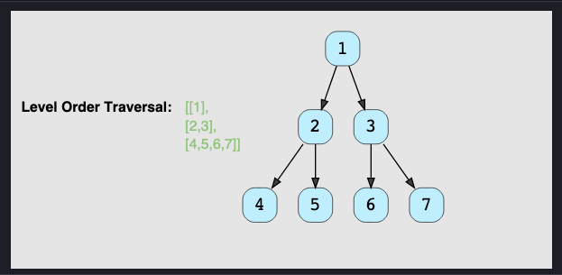

**Solution**

Since we need to traverse all nodes of each level before moving onto the next level, 
we can use the Breadth First Search (BFS) technique to solve this problem.

We can use a Queue to efficiently traverse in BFS fashion. 
Here are the steps of our algorithm:

1. Start by pushing the root node to the queue.
2. Keep iterating until the queue is empty.
3. In each iteration, first count the elements in the queue (let’s call it levelSize). 
We will have these many nodes in the current level.
4. Next, remove levelSize nodes from the queue and push their value 
in an array to represent the current level.
5. After removing each node from the queue, insert both of its children into the queue.
6. If the queue is not empty, repeat from step 3 for the next level.

Let’s take the example-2 mentioned above to visually represent our algorithm:

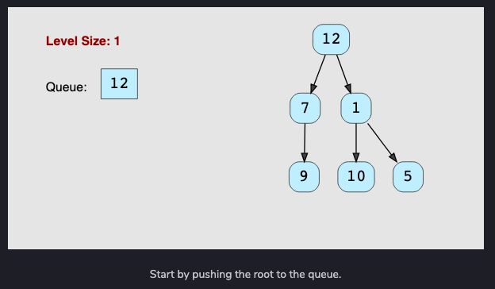
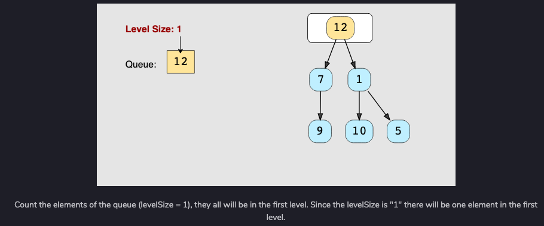
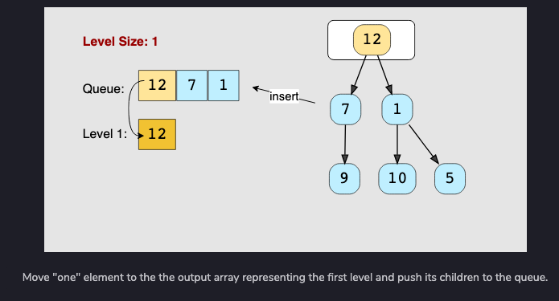
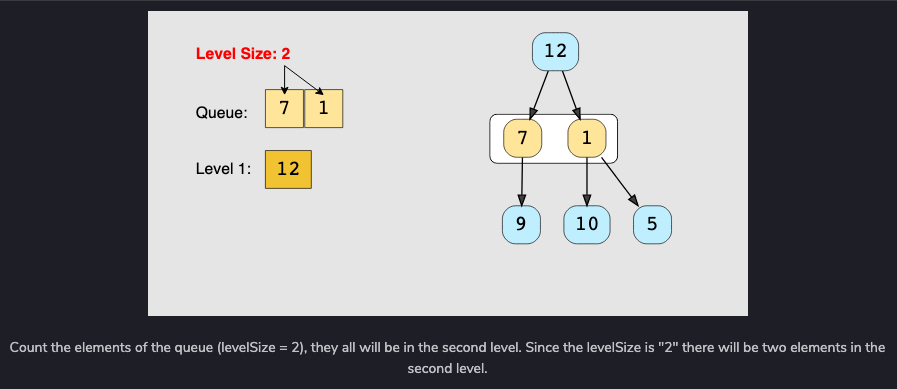
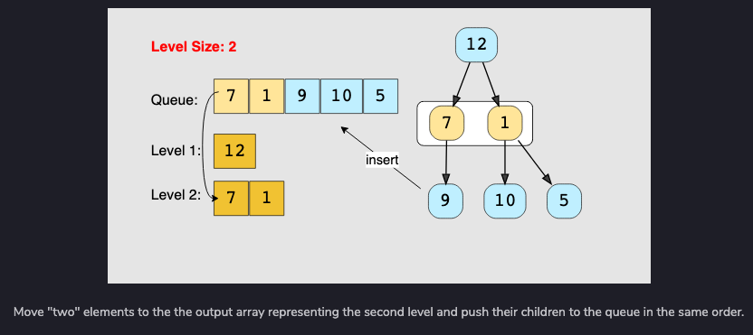
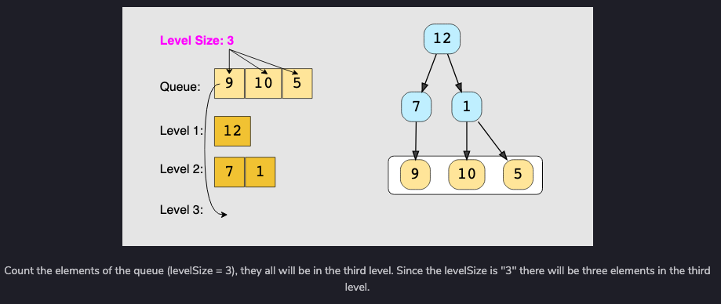
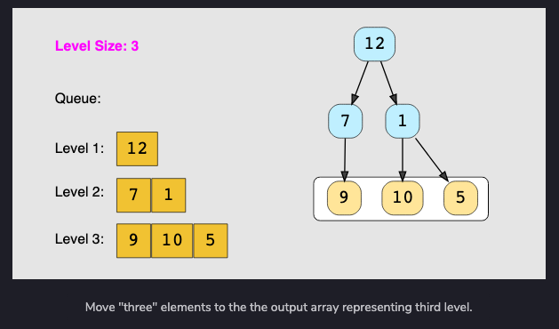


<br>


## Tree Depth First Search
This pattern is based on the ** Depth First Search (DFS)** technique to traverse a tree.

We will be using recursion (or we can also use a stack for the iterative approach) 
to keep track of all the previous (parent) nodes while traversing. 
This also means that the space complexity of the algorithm will be O(H), 
where ‘H’ is the maximum height of the tree.

Let’s jump onto our first problem to understand this pattern.


<br>

## Two Heaps
In many problems, where we are given a set of elements such 
that we can divide them into two parts. 
We are interested in knowing the smallest element in one part and the biggest 
element in the other part. The Two Heaps pattern is an efficient approach 
to solve such problems.

As the name suggests, this pattern uses two Heaps; 
A Min Heap to find the smallest element and a Max Heap to find the biggest element.

Let’s jump onto our first problem to see this pattern in action.

### Heap
A heap is a special complete binary tree in which the nodes follow the rules:
1. Min-Heap - Parents have a value lesser than the children (root is min)
2. Max-Heap - Parents have a value greater than the children (root is max)


### Problem Statement

Design a class to calculate the median of a number stream. 
The class should have the following two methods:

1. insertNum(int num): stores the number in the class
2. findMedian(): returns the median of all numbers inserted in the class

If the count of numbers inserted in the class is even, 
the median will be the average of the middle two numbers.

Example 1:
1. insertNum(3)
2. insertNum(1)
3. findMedian() -> output: 2
4. insertNum(5)
5. findMedian() -> output: 3
6. insertNum(4)
7. findMedian() -> output: 3.5

**Solution**

Assume ‘x’ is the median of a list. 
This means that half of the numbers in the list will be smaller than (or equal to) ‘x’
and half will be greater than (or equal to) ‘x’. 
This leads us to an approach where we can divide the list into two halves: 
one half to store all the smaller numbers (let’s call it smallNumList) and one half 
to store the larger numbers (let’s call it largeNumList). 
The median of all the numbers will either be the largest number in the smallNumList 
or the smallest number in the largeNumList. If the total number of elements is even, 
the median will be the average of these two numbers.

The best data structure that comes to mind to find the smallest or largest 
number among a list of numbers is a Heap. Let’s see how we can use a heap to find 
a better algorithm.

1. We can store the first half of numbers (i.e., smallNumList) in a Max Heap. 
We should use a Max Heap as we are interested in knowing the largest number in 
the first half.
2. We can store the second half of numbers (i.e., largeNumList) in a Min Heap, 
as we are interested in knowing the smallest number in the second half.
3. Inserting a number in a heap will take O(logN), which is better than the 
brute force approach (it takes O(N) with insertion sort).
4. At any time, the median of the current list of numbers can be calculated 
from the top element of the two heaps.

**Procedure Example 1**
1. **insertNum(3)**: We can insert a number in the Max Heap (i.e. first half) 
if the number is smaller than the top (largest) number of the heap. 
After every insertion, we will balance the number of elements in both heaps, 
so that they have an equal number of elements. 
If the count of numbers is odd, let’s decide to have more numbers in Max Heap 
than the Min Heap.

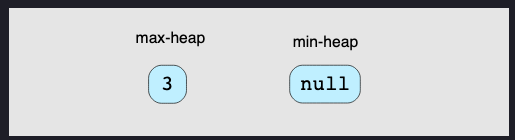

2. **insertNum(1)**: As ‘1’ is smaller than ‘3’, let’s insert it into the Max Heap.

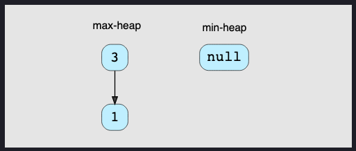

Now, we have two elements in the Max Heap and no elements in Min Heap. 
Let’s take the largest element from the Max Heap and insert it into the Min Heap, 
to balance the number of elements in both heaps.

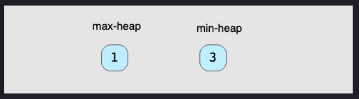

3. **findMedian()**: As we have an even number of elements, the median will be the average of the top element of both the heaps -> (1+3)/2 = 2.0
(1+3)/2=2.0
4. **insertNum(5)**: As ‘5’ is greater than the top element of the Max Heap, 
we can insert it into the Min Heap. After the insertion, 
the total count of elements will be odd. As we had decided to have more 
numbers in the Max Heap than the Min Heap, we can take the top (smallest) 
number from the Min Heap and insert it into the Max Heap.

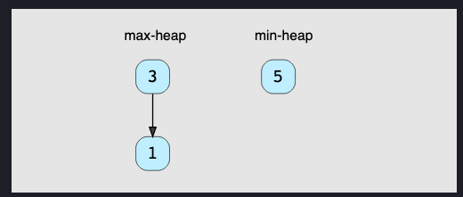

5. **findMedian()**: Since we have an odd number of elements, 
the median will be the top element of Max Heap -> 3. 
An odd number of elements also means that the Max Heap will have one extra 
element than the Min Heap.

6. **insertNum(4)**: Insert ‘4’ into Min Heap.

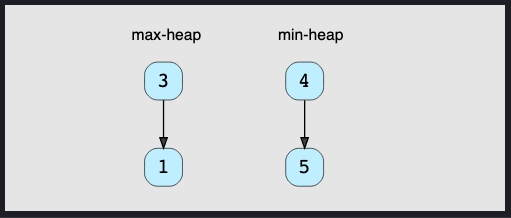

7. **findMedian()**: As we have an even number of elements, 
the median will be the average of the top element of both the heaps -> (3+4)/2 = 3.5


<br>


## Subsets
A huge number of coding interview problems involve dealing with 
Permutations and Combinations of a given set of elements. 
This pattern describes an efficient Breadth First Search (BFS) approach 
to handle all these problems.

### Problem Statement
Given a set with distinct elements, find all of its distinct subsets.

```
Example 1:
Input: [1, 3]
Output: [], [1], [3], [1,3]

Example 2:
Input: [1, 5, 3]
Output: [], [1], [5], [3], [1,5], [1,3], [5,3], [1,5,3]
```

**Solution**
To generate all subsets of the given set, we can use the 
Breadth First Search (BFS) approach. We can start with an empty set, 
iterate through all numbers one-by-one, and add them to existing sets 
to create new subsets.

Let’s take the example-2 mentioned above to go through each 
step of our algorithm:

Given set: [1, 5, 3]

1. Start with an empty set: [[]]
2. Add the first number (1) to all the existing subsets to create 
new subsets: [[], [1]];
3. Add the second number (5) to all the existing subsets: 
[[], [1], [5], [1,5]];
4. Add the third number (3) to all the existing subsets: 
[[], [1], [5], [1,5], [3], [1,3], [5,3], [1,5,3]].


<br>


## Modified Binary Search
As we know, whenever we are given a sorted Array or LinkedList or Matrix, 
and we are asked to find a certain element, 
the best algorithm we can use is the Binary Search.

This pattern describes an efficient way to handle all problems involving 
Binary Search. We will go through a set of problems that will help us 
build an understanding of this pattern so that we can apply this 
technique to other problems we might come across in the interviews.

Let’s start with our first problem.

### Order-agnostic Binary Search
Given a sorted array of numbers, 
find if a given number ‘key’ is present in the array. 
Though we know that the array is sorted, we don’t know if it’s sorted 
in ascending or descending order. You should assume that the array can
have duplicates.

Write a function to return the index of the ‘key’ if it is present 
in the array, otherwise return -1.

```
Example 1:
Input: [4, 6, 10], key = 10
Output: 2

Example 2:
Input: [1, 2, 3, 4, 5, 6, 7], key = 5
Output: 4

Example 3:
Input: [10, 6, 4], key = 10
Output: 0

Example 4:
Input: [10, 6, 4], key = 4
Output: 2
```

**Solution**

To make things simple, let’s first solve this problem assuming that the input array is sorted in ascending order. 
Here are the set of steps for Binary Search:

1. Let’s assume start is pointing to the first index and end is pointing to the last index of the input array
(let’s call it arr). This means:
``` python
start = 0
end = len(arr) - 1
```
2. First, we will find the middle of start and end. 
An easy way to find the middle would be: middle=(start+end)/2.
For Java and C++, this equation will work for most cases, 
but when start or end is large, this equation will give us the
wrong result due to integer overflow. Imagine that end is equal to 
the maximum range of an integer (e.g. for Java: int end = Integer.MAX_VALUE).
Now adding any positive number to end will result in an integer overflow.
Since we need to add both the numbers first to evaluate our equation, 
an overflow might occur. The safest way to find the middle of two numbers
without getting an overflow is as follows:
``` python
middle  = start + (end-start)/2
```
This is not true for Python, since it does not have a integer overflow problem.

3. Next, we will see if the ‘key’ is equal to the number at index middle. 
If it is equal we return middle as the required index.
4. If ‘key’ is not equal to number at index middle, we have to check 
two things:
   - If key < arr[middle], then we can conclude that the key will be 
   smaller than all the numbers after index middle as the array is sorted
   in the ascending order. Hence, we can reduce our search to 
   end = mid - 1.
   - If key > arr[middle], then we can conclude that the key will 
   be greater than all numbers before index middle as the array is 
   sorted in the ascending order. Hence, we can reduce our search to 
   start = mid + 1.
5. We will repeat steps 2-4 with new ranges of start to end. If at any time start becomes greater than end, 
this means that we can’t find the ‘key’ in the input array and we must return ‘-1’.

If the array is sorted in the descending order, 
we have to update the step 4 above as:

- If key > arr[middle], then we can conclude that the key will be 
greater than all numbers after index middle as the array is sorted 
in the descending order. Hence, we can reduce our search to end = mid - 1.
- If key < arr[middle], then we can conclude that the key will be 
smaller than all the numbers before index middle as the array is sorted 
in the descending order. Hence, we can reduce our search to 
start = mid + 1.

Finally, how can we figure out the sort order of the input array? 
We can compare the numbers pointed out by start and end index to find
the sort order. If arr[start] < arr[end], it means that the numbers 
are sorted in ascending order otherwise they are sorted in the descending 
order.


<br>


## Bitwise XOR
XOR is a logical bitwise operator that returns 0 (false) if both bits 
are the same and returns 1 (true) otherwise. 
In other words, it only returns 1 if exactly one bit is set to 1 out 
of the two bits in comparison.

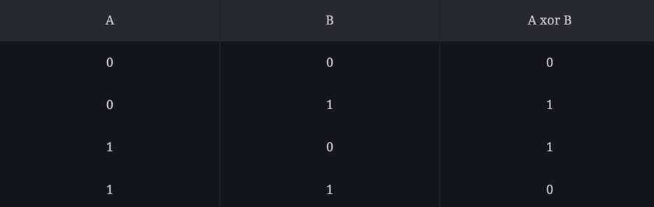

It is surprising to know the approaches that the XOR operator enables
us to solve certain problems. For example, let’s take a look at the 
following problem:

```
Given an array of n-1 integers in the range from 1 to n
find the one number that is missing from the array.

Example:
Input: 1, 5, 2, 6, 4
Answer: 3
```

Remember the important property of XOR that it returns 0 if both the bits
in comparison are the same. In other words, XOR of a number with itself 
will always result in 0. This means that if we XOR all the numbers in 
the input array with all numbers from the range 1 to n
then each number in the input is going to get zeroed out except the 
missing number. Following are the set of steps to find the missing 
number using XOR:

1. XOR all the numbers from 1 to n , let’s call it x1.
X2. OR all the numbers in the input array, let’s call it x2.
2. The missing number can be found by x1 XOR x


<br>


## Top 'K' Elements
Any problem that asks us to find the top/smallest/frequent ‘K’ elements 
among a given set falls under this pattern.

The best data structure that comes to mind to keep track of ‘K’ elements 
is Heap. This pattern will make use of the Heap to solve multiple 
problems dealing with ‘K’ elements at a time from a set of given elements.

Let’s jump onto our first problem to develop an understanding of this 
pattern.

### Top 'K' Numbers
Given an unsorted array of numbers, find the ‘K’ largest numbers in it.

```
Example 1:
Input: [3, 1, 5, 12, 2, 11], K = 3
Output: [5, 12, 11]

Example 2:
Input: [5, 12, 11, -1, 12], K = 3
Output: [12, 11, 12]
```

A brute force solution could be to sort the array and return the largest 
K numbers. The time complexity of such an algorithm will be O(N*logN)
as we need to use a sorting algorithm like Timsort if we use Java’s Collection.
sort(). Can we do better than that?

The best data structure that comes to mind to keep track of top ‘K’ elements is Heap. 
Let’s see if we can use a heap to find a better algorithm.

If we iterate through the array one element at a time and keep ‘K’ largest numbers 
in a heap such that each time we find a larger number than the smallest number in the heap, 
we do two things:

1. Take out the smallest number from the heap, and 
2. Insert the larger number into the heap.

This will ensure that we always have ‘K’ largest numbers in the heap. 
The most efficient way to repeatedly find the smallest number among a set of numbers will be 
to use a min-heap. As we know, we can find the smallest number in a min-heap in constant 
time O(1), since the smallest number is always at the root of the heap. 
Extracting the smallest number from a min-heap will take O(logN) 
(if the heap has ‘N’ elements) as the heap needs to readjust after the removal of an element.

Let’s take Example-1 to go through each step of our algorithm:

Given array: [3, 1, 5, 12, 2, 11], and K=3

1. First, let’s insert ‘K’ elements in the min-heap.
2. After the insertion, the heap will have three numbers [3, 1, 5] with ‘1’ being the 
root as it is the smallest element.
3. We’ll iterate through the remaining numbers and perform the above-mentioned two steps 
if we find a number larger than the root of the heap.
4. The 4th number is ‘12’ which is larger than the root (which is ‘1’), 
so let’s take out ‘1’ and insert ‘12’. Now the heap will have [3, 5, 12] with ‘3’ 
being the root as it is the smallest element.
5. The 5th number is ‘2’ which is not bigger than the root of the heap (‘3’), 
so we can skip this as we already have top three numbers in the heap.
6. The last number is ‘11’ which is bigger than the root (which is ‘3’), so let’s take 
out ‘3’ and insert ‘11’. Finally, the heap has the largest three numbers: [5, 12, 11]

As discussed above, it will take us O(logK) to extract the minimum number from the min-heap. 
So the overall time complexity of our algorithm will be O(K*logK+(N-K)*logK)
since, first, we insert ‘K’ numbers in the heap and then iterate through the 
remaining numbers and at every step, in the worst case, we need to extract the 
minimum number and insert a new number in the heap. This algorithm is better than O(N*logN).


<br>


## K-way Merge
This pattern helps us solve problems that involve a list of sorted arrays.

Whenever we are given ‘K’ sorted arrays, we can use a Heap to efficiently 
perform a sorted traversal of all the elements of all arrays. 
We can push the smallest (first) element of each sorted array in a Min Heap 
to get the overall minimum. While inserting elements to the Min Heap 
we keep track of which array the element came from. We can, then, 
remove the top element from the heap to get the smallest element and push 
the next element from the same array, to which this smallest element belonged, 
to the heap. We can repeat this process to make a sorted traversal of all elements.

### Merge K Sorted Lists
```
Given an array of ‘K’ sorted LinkedLists, merge them into one sorted list.

Example 1:
Input: L1=[2, 6, 8], L2=[3, 6, 7], L3=[1, 3, 4]
Output: [1, 2, 3, 3, 4, 6, 6, 7, 8]

Example 2:
Input: L1=[5, 8, 9], L2=[1, 7]
Output: [1, 5, 7, 8, 9]
```

A brute force solution could be to add all elements of the given ‘K’ lists 
to one list and sort it. If there are a total of ‘N’ elements in all the input 
lists, then the brute force solution will have a time complexity of O(N*logN)
as we will need to sort the merged list. 
Can we do better than this? 
How can we utilize the fact that the input lists are individually sorted?

If we have to find the smallest element of all the input lists, 
we have to compare only the smallest (i.e. the first) element of all the lists. 
Once we have the smallest element, we can put it in the merged list. 
Following a similar pattern, we can then find the next smallest element
of all the lists to add it to the merged list.

The best data structure that comes to mind to find the smallest number 
among a set of ‘K’ numbers is a Heap. Let’s see how can we use a heap to 
find a better algorithm.

1. We can insert the first element of each array in a Min Heap.
2. After this, we can take out the smallest (top) element from 
the heap and add it to the merged list.
3. After removing the smallest element from the heap, we can insert 
the next element of the same list into the heap.
4. We can repeat steps 2 and 3 to populate the merged list in sorted order.

Let’s take the Example-1 mentioned above to go through each step of our algorithm:

Given lists: L1=[2, 6, 8], L2=[3, 6, 7], L3=[1, 3, 4]

1. After inserting the 1st element of each list, the heap will have the following
elements:

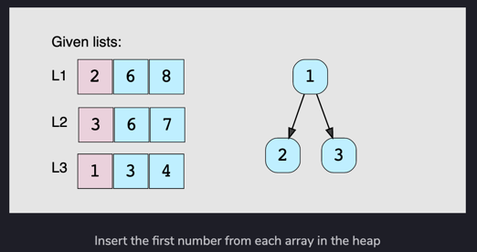

2. We’ll take the top number from the heap, insert it into the merged list and add the next number in the heap.

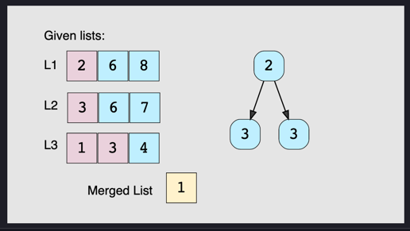

3. Again, we’ll take the top element of the heap, insert it into the merged list and add the next number to the heap.

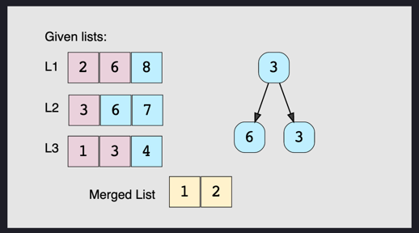

4. Repeating the above step, take the top element of the heap, 
insert it into the merged list and add the next number to the heap. 
As there are two 3s in the heap, we can pick anyone but we need to take 
the next element from the corresponding list to insert in the heap.

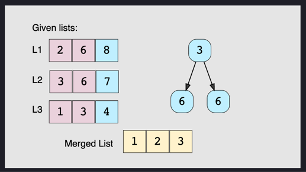


<br>


## Topological Sort - Graph
Topological Sort is used to find a linear ordering of elements that have dependencies on each other. 
For example, if event ‘B’ is dependent on event ‘A’, ‘A’ comes before ‘B’ in topological ordering.

This pattern defines an easy way to understand the technique for performing topological sorting 
of a set of elements and then solves a few problems using it.

### Topological Sort
Topological Sort of a directed graph (a graph with unidirectional edges) is a linear ordering 
of its vertices such that for every directed edge (U, V) from vertex U to vertex V, U comes 
before V in the ordering.

Given a directed graph, find the topological ordering of its vertices.

**Example 1**
```
Input: Vertices=4, Edges=[3, 2], [3, 0], [2, 0], [2, 1]
Output: Following are the two valid topological sorts for the given graph:
1) 3, 2, 0, 1
2) 3, 2, 1, 0
```

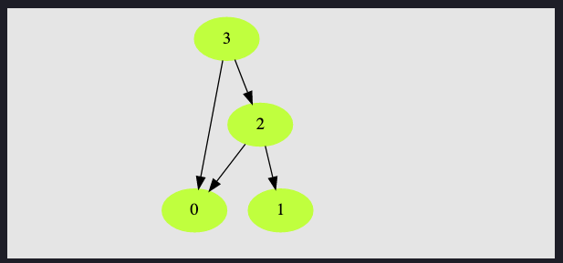

**Example 2**
```
Input: Vertices=5, Edges=[4, 2], [4, 3], [2, 0], [2, 1], [3, 1]
Output: Following are all valid topological sorts for the given graph:
1) 4, 2, 3, 0, 1
2) 4, 3, 2, 0, 1
3) 4, 3, 2, 1, 0
4) 4, 2, 3, 1, 0
5) 4, 2, 0, 3, 1
```

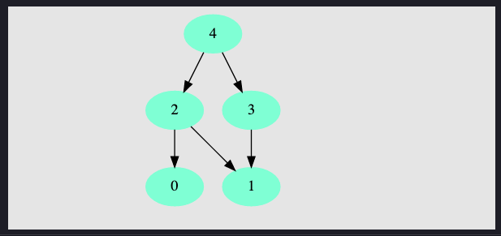

**Example 3**
```
Input: Vertices=7, Edges=[6, 4], [6, 2], [5, 3], [5, 4], [3, 0], [3, 1], [3, 2], [4, 1]
Output: Following are all valid topological sorts for the given graph:
1) 5, 6, 3, 4, 0, 1, 2
2) 6, 5, 3, 4, 0, 1, 2
3) 5, 6, 4, 3, 0, 2, 1
4) 6, 5, 4, 3, 0, 1, 2
5) 5, 6, 3, 4, 0, 2, 1
6) 5, 6, 3, 4, 1, 2, 0

There are other valid topological ordering of the graph too.
```

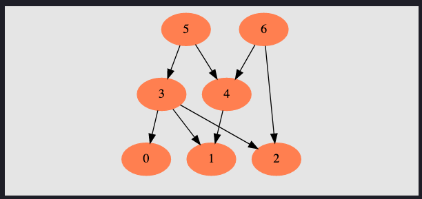

**Solution**
The basic idea behind the topological sort is to provide a partial ordering among the vertices 
of the graph such that if there is an edge from U to V then U≤V i.e., U comes before V in the ordering. 
Here are a few fundamental concepts related to topological sort:

1. **Source**: Any node that has no incoming edge and has only outgoing edges is called a source.

2. **Sink**: Any node that has only incoming edges and no outgoing edge is called a sink.

3. So, we can say that a topological ordering starts with one of the sources and ends at one of the sinks.

4. A topological ordering is possible only when the graph has no directed cycles, 
i.e. if the graph is a **Directed Acyclic Graph (DAG)**. If the graph has a cycle, 
some vertices will have cyclic dependencies which makes it impossible to find a linear ordering 
among vertices.

To find the topological sort of a graph we can traverse the graph in a Breadth First Search (BFS) way. 
We will start with all the sources, and in a stepwise fashion, save all sources to a sorted list. 
We will then remove all sources and their edges from the graph. 
After the removal of the edges, we will have new sources, so we will repeat the above process until 
all vertices are visited.

Here is the visual representation of this algorithm for Example-3:

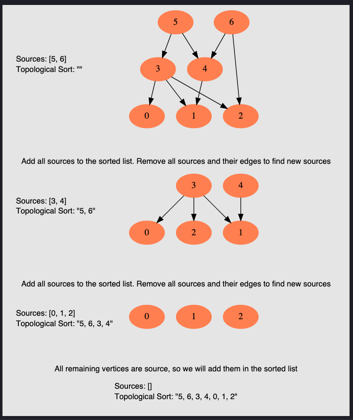

This is how we can implement this algorithm:

**a. Initialization**
1. We will store the graph in Adjacency Lists, which means each parent vertex will have a list 
containing all of its children. We will do this using a HashMap where the ‘key’ will be the parent 
vertex number and the value will be a List containing children vertices.
2. To find the sources, we will keep a HashMap to count the in-degrees 
i.e., count of incoming edges of each vertex. Any vertex with ‘0’ in-degree will be a source.

**b. Build the graph and find in-degrees of all vertices**
1. We will build the graph from the input and populate the in-degrees HashMap.

**c. Find all sources**
1. All vertices with ‘0’ in-degrees will be our sources and we will store them in a Queue.

**d. Sort**
1. For each source, do the following things:
   - Add it to the sorted list.
   - Get all of its children from the graph.
   - Decrement the in-degree of each child by 1.
   - If a child’s in-degree becomes ‘0’, add it to the sources Queue.
2. Repeat step 1, until the source Queue is empty.