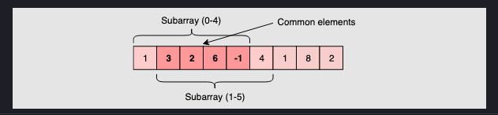

# cracking_the_code
Repository regarding coding interview questions and challenges

# Topics

## Sliding Window
In many problems dealing with an array (or a LinkedList), 
we are asked to find or calculate something among all the subarrays (or sublists) of a given size. 
For example, take a look at this problem
```
Given an array, find the average of all subarrays of ‘K’ contiguous elements in it.
```

Let’s understand this problem with a real input:
``` python
Array: [1, 3, 2, 6, -1, 4, 1, 8, 2], K=5
```
Here, we are asked to find the average of all subarrays of ‘5’ contiguous elements in the given array.
Let’s solve this:

1. For the first 5 numbers (subarray from index 0-4), the average is: (1+3+2+6-1)/5 => 2.2
(1+3+2+6−1)/5=>2.2
2. The average of next 5 numbers (subarray from index 1-5) is: (3+2+6-1+4)/5 => 2.8
(3+2+6−1+4)/5=>2.8
3. For the next 5 numbers (subarray from index 2-6), the average is: (2+6-1+4+1)/5 => 2.4
(2+6−1+4+1)/5=>2.4
4. ...

Here is the final output containing the averages of all subarrays of size 5:
``` python
Output: [2.2, 2.8, 2.4, 3.6, 2.8]
```

A brute-force algorithm will calculate the sum of every 5-element subarray of the given array and 
divide the sum by ‘5’ to find the average. This is what the algorithm will look like:

``` python
def find_averages_of_subarrays(K, arr):
  result = []
  for i in range(len(arr)-K+1):
    # find sum of next 'K' elements
    _sum = 0.0
    for j in range(i, i+K):
      _sum += arr[j]
    result.append(_sum/K)  # calculate average

  return result


def main():
  result = find_averages_of_subarrays(5, [1, 3, 2, 6, -1, 4, 1, 8, 2])
  print("Averages of subarrays of size K: " + str(result))


main()
```

**Time complexity**: Since for every element of the input array, we are calculating the sum 
of its next ‘K’ elements, the time complexity of the above algorithm will be O(N*K)
where ‘N’ is the number of elements in the input array.

Can we find a better solution? Do you see any inefficiency in the above approach?

The inefficiency is that for any two consecutive subarrays of size ‘5’, the overlapping part (which will contain four elements) will be evaluated twice. For example, take the above-mentioned input:



As you can see, there are four overlapping elements between the subarray 
(indexed from 0-4) and the subarray (indexed from 1-5). 
Can we somehow reuse the sum we have calculated for the overlapping elements?

The efficient way to solve this problem would be to visualize each subarray as a
sliding window of ‘5’ elements. This means that we will slide the window by one 
element when we move on to the next subarray. To reuse the sum from the previous 
subarray, we will subtract the element going out of the window and add the element 
now being included in the sliding window. This will save us from going through the 
whole subarray to find the sum and, as a result, the algorithm complexity will reduce 
to O(N).


Here is the algorithm for the Sliding Window approach:
``` python
def find_averages_of_subarrays(K, arr):
  result = []
  windowSum, windowStart = 0.0, 0
  for windowEnd in range(len(arr)):
    windowSum += arr[windowEnd]  # add the next element
    # slide the window, we don't need to slide if we've not hit the required window size of 'k'
    if windowEnd >= K - 1:
      result.append(windowSum / K)  # calculate the average
      windowSum -= arr[windowStart]  # subtract the element going out
      windowStart += 1  # slide the window ahead

  return result


def main():
  result = find_averages_of_subarrays(5, [1, 3, 2, 6, -1, 4, 1, 8, 2])
  print("Averages of subarrays of size K: " + str(result))


main()
```

### Smallest Subarray With a Greater Sum
This problem follows the Sliding Window pattern, and we can use a similar strategy 
as discussed in Maximum Sum Subarray of Size K. 
There is one difference though: in this problem, the sliding window size is not fixed. 
Here is how we will solve this problem:

1. First, we will add-up elements from the beginning of the array until their 
sum becomes greater than or equal to ‘S.’
2. These elements will constitute our sliding window. We are asked to find the 
smallest such window having a sum greater than or equal to ‘S.’ We will remember the length of this window as the smallest window so far.
3. After this, we will keep adding one element in the sliding window (i.e., slide the window ahead) in a stepwise fashion.
4. In each step, we will also try to shrink the window from the beginning. 
We will shrink the window until the window’s sum is smaller than ‘S’ again. 
This is needed as we intend to find the smallest window. This shrinking will also happen in multiple steps; in each step, we will do two things:
   - Check if the current window length is the smallest so far, and if so, remember its length.
   - Subtract the first element of the window from the running sum to shrink the sliding window.

Here is the visual representation of this algorithm for the Example-1:


**Time Complexity**

The time complexity of the above algorithm will be O(N)
The outer for loop runs for all elements, and the inner while loop processes each element only once; therefore, the time complexity of the algorithm will be O(N+N)
O(N+N), which is asymptotically equivalent to O(N).

**Space Complexity**

The algorithm runs in constant space O(1).

### Longest Substring Same Letters Replacement
This problem follows the Sliding Window pattern, and we can use a 
similar dynamic sliding window strategy as discussed in Longest 
Substring with Distinct Characters. We can use a HashMap to count the 
frequency of each letter.

- We will iterate through the string to add one letter at a time in the window.
- We will also keep track of the count of the maximum repeating letter in any 
window (let’s call it maxRepeatLetterCount).
- So, at any time, we know that we do have a window with one letter repeating 
maxRepeatLetterCount times; this means we should try to replace
the remaining letters.
  - If the remaining letters are less than or equal to k, we can replace them all.
  - If we have more than k remaining letters, we should shrink the window as we 
  cannot replace more than k letters.
  
While shrinking the window, we don’t need to update maxRepeatLetterCount. 
Since we are only interested in the longest valid substring, our sliding 
windows do not have to shrink, even if a window may cover an invalid substring. 
Either we expand the window by appending a character to the right or we shift the entire window to the right by one. 
We only expand the window when the frequency of the newly added character exceeds the historical maximum frequency 
(from a previous window that included a valid substring). In other words, we do not need to know the exact maximum count 
of the current window. The only thing we need to know is whether the maximum count exceeds the historical maximum count, 
and that can only happen because of the newly added char.

<br>

## Two Pointers
In problems where we deal with sorted arrays (or LinkedLists) and need to find 
a set of elements that fulfill certain constraints,
the Two Pointers approach becomes quite useful.
The set of elements could be a pair, a triplet or even a subarray. 
For example, take a look at the following problem:

```
Given an array of sorted numbers and a target sum, 
find a pair in the array whose sum is equal to the given target.
```

To solve this problem, we can consider each element one by one 
(pointed out by the first pointer) and iterate through the remaining 
elements (pointed out by the second pointer) to find a pair with the given sum. 
The time complexity of this algorithm will be O(N^2) where ‘N’ is the number 
of elements in the input array.

Given that the input array is sorted, an efficient way would be to start 
with one pointer in the beginning and another pointer at the end. 
At every step, we will see if the numbers pointed by the two pointers 
add up to the target sum. If they do not, we will do one of two things:

1. If the sum of the two numbers pointed by the two pointers is greater 
than the target sum, this means that we need a pair with a smaller sum.
So, to try more pairs, we can decrement the end-pointer.
2. If the sum of the two numbers pointed by the two pointers is 
smaller than the target sum, this means that we need a pair with a larger sum. 
So, to try more pairs, we can increment the start-pointer.

Here is the visual representation of this algorithm:


The time complexity of the above algorithm will be O(N).

<br>

## Fast & Slow Pointers

The Fast & Slow pointer approach, also known as the Hare & Tortoise algorithm, 
is a pointer algorithm that uses two pointers which move through the array 
(or sequence/LinkedList) at different speeds. 
This approach is quite useful when dealing with cyclic LinkedLists or arrays.

By moving at different speeds (say, in a cyclic LinkedList), 
the algorithm proves that the two pointers are bound to meet. 
The fast pointer should catch the slow pointer once both the pointers are in a 
cyclic loop.

One of the famous problems solved using this technique was Finding 
a cycle in a LinkedList. 

Let’s jump onto this problem to understand the Fast & Slow pattern.

```
Given the head of a Singly LinkedList, write a function to determine 
if the LinkedList has a cycle in it or not.
```


Imagine two racers running in a circular racing track. 
If one racer is faster than the other, the faster racer is bound to catch up 
and cross the slower racer from behind. 
We can use this fact to devise an algorithm to determine if a LinkedList has a 
cycle in it or not.

Imagine we have a slow and a fast pointer to traverse the LinkedList. 
In each iteration, the slow pointer moves one step and the fast pointer moves 
two steps. This gives us two conclusions:

1. If the LinkedList doesn’t have a cycle in it, the fast 
pointer will reach the end of the LinkedList before the slow pointer to 
reveal that there is no cycle in the LinkedList.
2. The slow pointer will never be able to catch up to the fast pointer if
there is no cycle in the LinkedList.

If the LinkedList has a cycle, the fast pointer enters the cycle first, 
followed by the slow pointer. After this, both pointers will keep moving 
in the cycle infinitely. If at any stage both of these pointers meet, 
we can conclude that the LinkedList has a cycle in it. 
Let’s analyze if it is possible for the two pointers to meet. 
When the fast pointer is approaching the slow pointer from behind 
we have two possibilities:

1. The fast pointer is one step behind the slow pointer.
2. The fast pointer is two steps behind the slow pointer.

All other distances between the fast and slow pointers will 
reduce to one of these two possibilities. 
Let’s analyze these scenarios, considering the fast pointer always moves first:

1. If the fast pointer is one step behind the slow pointer: 
The fast pointer moves two steps and the slow pointer moves one step,
and they both meet.
2. If the fast pointer is two steps behind the slow pointer: 
he fast pointer moves two steps and the slow pointer moves one step. 
After the moves, the fast pointer will be one step behind the slow pointer, 
which reduces this scenario to the first scenario. This means that the two 
pointers will meet in the next iteration.

This concludes that the two pointers will definitely meet if the LinkedList
has a cycle. A similar analysis can be done where the slow pointer moves first. 
Here is a visual representation of the above discussion:


### Happy Number
Any number will be called a happy number if, after repeatedly replacing 
it with a number equal to the sum of the square of all of its digits, 
leads us to number ‘1’. All other (not-happy) numbers will never reach ‘1’. 
Instead, they will be stuck in a cycle of numbers which does not include ‘1’.

**Example 1**
``` python
Input: 23   
Output: true (23 is a happy number)  
Explanations: Here are the steps to find out that 23 is a happy number:
```


**Example 2**
``` python
Input: 12   
Output: false (12 is not a happy number)  
Explanations: Here are the steps to find out that 12 is not a happy number:
```


Step ‘13’ leads us back to step ‘5’ as the number becomes equal to ‘89’, 
this means that we can never reach ‘1’, 
therefore, ‘12’ is not a happy number.

<br>

## Merge Intervals
This pattern describes an efficient technique to deal with overlapping 
intervals. In a lot of problems involving intervals, 
we either need to find overlapping intervals or merge intervals if 
they overlap.

Given two intervals (‘a’ and ‘b’), there will be six different ways 
the two intervals can relate to each other:


### Merge Intervals
Given a list of intervals, merge all the overlapping intervals to produce 
a list that has only mutually exclusive intervals.

``` python
Intervals: [[1,4], [2,5], [7,9]]
Output: [[1,5], [7,9]]
Explanation: Since the first two intervals [1,4] and [2,5] overlap, 
we merged them into one [1,5].
```


**Solution**
Let’s take the example of two intervals (‘a’ and ‘b’) such that a.start 
<= b.start. There are four possible scenarios:


Our goal is to merge the intervals whenever they overlap. 
For the above-mentioned three overlapping scenarios (2, 3, and 4), 
this is how we will merge them:


The diagram above clearly shows a merging approach. 
Our algorithm will look like this:

1. Sort the intervals on the start time to ensure a.start <= b.start
2. If ‘a’ overlaps ‘b’ (i.e. b.start <= a.end),
we need to merge them into a new interval ‘c’ such that:
``` python
c.start = a.start
c.end = max(a.end, b.end)
```
3. We will keep repeating the above two steps to merge ‘c’ with the next interval if it 
overlaps with ‘c’.


<br>

## Cyclic Sort
This pattern describes an interesting approach to deal with problems involving arrays 
containing numbers in a given range. For example, take the following problem:
```
You are given an unsorted array containing n numbers taken from the range 1 to n. 
The array can have duplicates, 
which means that some numbers will be missing. Find all the missing numbers.
```
To efficiently solve this problem, we can use the fact that the input array 
contains numbers in the range of 1 to n. For example, to efficiently sort the array, 
we can try placing each number at its correct place, i.e., placing 1 at index '0',
placing 2 at index ‘1’, and so on. Once we are done with the sorting, we can iterate 
the array to find all indices missing the correct numbers. These will be our required numbers.

Let’s jump on to our first problem to understand the Cyclic Sort pattern in detail.

### Cyclic Sort Problem
We are given an array containing n objects. Each object, 
when created, was assigned a unique number from the range 1 to n 
based on their creation sequence. This means that the object
with sequence number 3 was created just before the object with 
sequence number 4.

Write a function to sort the objects in-place on their creation 
sequence number in O(n) and without using any extra space.
For simplicity, let’s assume we are passed an integer array containing 
only the sequence numbers, though each number is actually an object.

``` python
Example 1
Input: [3, 1, 5, 4, 2]
Output: [1, 2, 3, 4, 5]

Example 2:
Input: [2, 6, 4, 3, 1, 5]
Output: [1, 2, 3, 4, 5, 6]

Example 3:
Input: [1, 5, 6, 4, 3, 2]
Output: [1, 2, 3, 4, 5, 6]
```

**Solution**
As we know, the input array contains numbers from the range 1 to n. 
We can use this fact to devise an efficient way to sort the numbers. 
Since all numbers are unique, we can try placing each number at its correct 
place, i.e., placing 1 at index ‘0’, placing 2 at index ‘1’, and so on.

To place a number (or an object in general) at its correct index, 
we first need to find that number. If we first find a number and then 
place it at its correct place, it will take us O(N^2), which is not acceptable.

Instead, what if we iterate the array one number at a time, 
and if the current number we are iterating is not at the correct index, 
we swap it with the number at its correct index. 
This way, we will go through all numbers and place them at their correct 
indices, hence, sorting the whole array.

Let’s see this visually with the above-mentioned Example-2:


<br>


## In-place Reversal of a LinkedList
In a lot of problems, we are asked to reverse the links between a set of nodes 
of a LinkedList. Often, the constraint is that we need to do this in-place, 
i.e., using the existing node objects and without using extra memory.

``` python
Given the head of a Singly LinkedList, reverse the LinkedList. 
Write a function to return the new head of the reversed LinkedList.
```


To reverse a LinkedList, we need to reverse one node at a time. We will start with a variable current which will initially point to the head of the LinkedList and a variable previous which will point to the previous node that we have processed; initially previous will point to null.

In a stepwise manner, we will reverse the current node by pointing it to the previous before moving on to the next node. Also, we will update the previous to always point to the previous node that we have processed. Here is the visual representation of our algorithm: